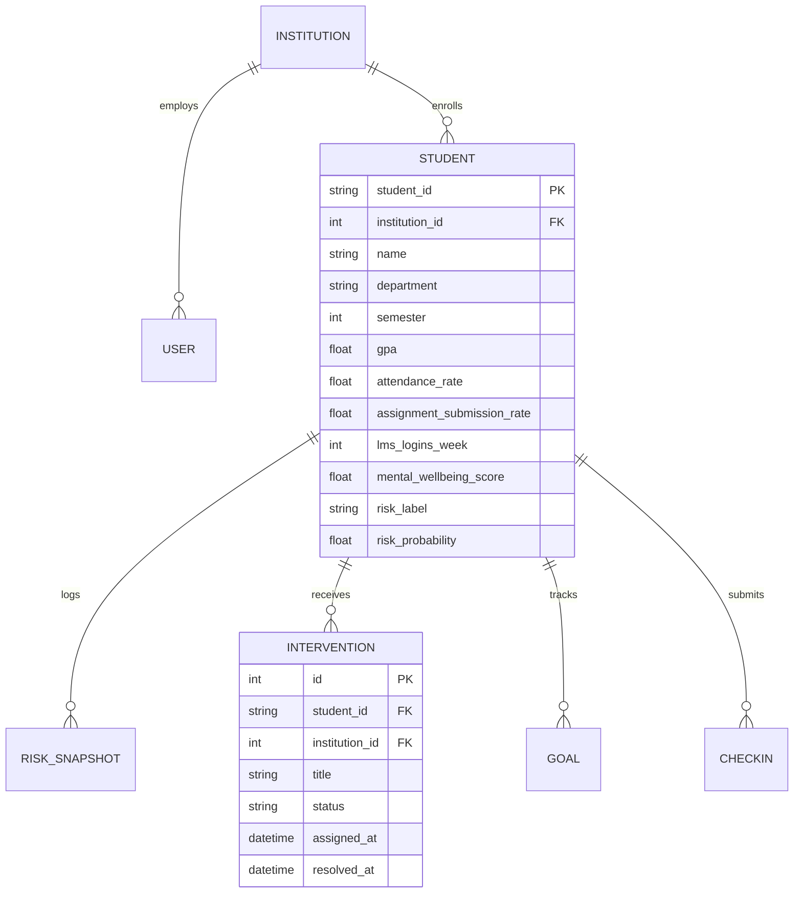

# 🛡️ EduGuard — System Architecture & Technical Specification

**Project Name:** EduGuard  
**Domain:** Higher Education Student Retention & Attrition Prevention  
**Hackathon Target:** Smart India Hackathon (SIH 2026)  
**Repository:** [https://github.com/VAnsh1107/eduguard-sih-2026](https://github.com/VAnsh1107/eduguard-sih-2026)  

---

## 📐 1. Executive Summary

EduGuard is an institutional-grade, AI-powered early warning and student retention platform. Designed to address the critical 15%–20% annual undergraduate attrition rate, EduGuard shifts university interventions from reactive post-examination remediation to proactive pre-crisis support within the **Weeks 2 to 6 window** of an academic term.

The platform integrates 12 multi-dimensional indicators spanning academic performance, digital learning management system (LMS) engagement, library activity, commuting distance, and self-reported mental wellbeing. It combines machine learning risk predictions, game-theoretic SHAP factor attributions, counterfactual "What-If" simulation, transparent rule-based intervention prioritization, and multi-tenant security.

---

## 🏗️ 2. High-Level Architecture & Data Flow

```
                      ┌─────────────────────────────────────────┐
                      │              React 18 SPA               │
                      │  (Admin / Teacher / Student Portals)    │
                      └────────────────────┬────────────────────┘
                                           │
                                    REST & WebSockets
                                           │
                                           ▼
                      ┌─────────────────────────────────────────┐
                      │             Python Flask API            │
                      │   (Flask-JWT-Extended + SocketIO)       │
                      └───────────┬─────────────────┬───────────┘
                                  │                 │
            ┌─────────────────────┘                 └─────────────────────┐
            ▼                                                             ▼
┌───────────────────────────┐                                 ┌───────────────────────────┐
│     ML Inference Engine   │                                 │     SQLite / PostgreSQL   │
│ (VotingEnsemble + SHAP)   │                                 │   (TenantScopedMixin)     │
└───────────────────────────┘                                 └───────────────────────────┘
```

### End-to-End Core Workflow:
1. **Multi-Dimensional Signal Ingestion:** Collects 12 structured student performance and engagement features.
2. **Ensemble Risk Prediction:** Standardizes feature vectors and executes soft-voting inference across RandomForest and XGBoost classifiers to assign a student to **Low**, **Medium**, or **High** risk tier.
3. **Dual SHAP Attribution:** Evaluates independent `TreeExplainer` models to extract the top positive and negative factor attributions driving the risk classification.
4. **Counterfactual "What-If" Simulation:** Re-runs backend model inference dynamically when mentors adjust proposed student metrics (e.g. +10% attendance), yielding predicted probability deltas and risk category transitions.
5. **Rule-Based Support Dispatch:** Matches top SHAP risk drivers to prescriptive intervention programs (tutoring, counseling, transport subsidy) via auditable rule logic.
6. **Longitudinal Outcome Monitoring:** Tracks risk probability trajectories before and after intervention resolution.

---

## 🧠 3. Machine Learning Specification

### 3.1 Feature Vector (12 Indicators)
| # | Feature Key | Data Type | Range / Units | Description |
|---|---|---|---|---|
| 1 | `attendance_rate` | Float | 0.0 – 100.0 % | Term lecture attendance percentage |
| 2 | `gpa` | Float | 0.0 – 10.0 | Cumulative Grade Point Average |
| 3 | `assignment_submission_rate` | Float | 0.0 – 100.0 % | Assignment submission completion rate |
| 4 | `lms_login_frequency` | Integer | 0 – 30 / week | Digital course portal logins per week |
| 5 | `library_visits` | Integer | 0 – 30 / month | Physical/digital library access count |
| 6 | `socioeconomic_score` | Float | 1.0 – 10.0 | Normalized household economic indicator |
| 7 | `scholarship_recipient` | Binary | 0 or 1 | Active institutional financial aid status |
| 8 | `family_income_bracket` | Integer | 1 – 5 | Income tier index |
| 9 | `previous_backlogs` | Integer | 0 – 10 | Uncleared course backlogs count |
| 10| `distance_from_college` | Float | 0.0 – 100.0 km | Daily commuting distance to campus |
| 11| `extracurricular_participation` | Binary | 0 or 1 | Active campus club/sports membership |
| 12| `mental_health_score` | Float | 1.0 – 10.0 | 5-D weekly self-checkin wellbeing score |

### 3.2 Model Pipeline & Cross-Validation
* **Preprocessing:** `StandardScaler()` fit strictly inside each cross-validation fold.
* **Ensemble Architecture:** `VotingClassifier(voting='soft', weights=[0.5, 0.5])` combining:
  * **RandomForestClassifier:** `n_estimators=150, max_depth=8, random_state=42`
  * **XGBClassifier:** `n_estimators=100, learning_rate=0.05, max_depth=5, random_state=42`
* **Validation Methodology:** 5-Fold Stratified Cross-Validation with pipeline isolation to eliminate data leakage.

### 3.3 Verified Performance Metrics
```
+------------------------------------+-----------------------+
| Metric                             | Value                 |
+------------------------------------+-----------------------+
| 5-Fold Stratified CV Macro F1      | 82.32% ± 2.68%        |
| Test Accuracy                      | 87.10%                |
| Test Macro F1                      | 79.49%                |
| Test Weighted F1                   | 86.80%                |
+------------------------------------+-----------------------+
```

### 3.4 Game-Theoretic SHAP Explainability
* **Dual TreeExplainers:** Evaluates XGBoost (margin/log-odds space) and RandomForest (probability space) explainers independently.
* **Native-Space Additivity:** Verifies `base_value + sum(shap_values) == native_output` per tree model before aggregating weighted feature attributions for human-interpretable display.

---

## 🔒 4. Multi-Tenant Security & RBAC Architecture

### 4.1 Role-Based Access Control (RBAC) Matrix
| Endpoint / Resource | `super_admin` | `admin` | `teacher` | `student` |
|---|---|---|---|---|
| Institutional Analytics (`/api/stats`) | Global | Own Institution | Own Institution | ❌ Forbidden |
| Student Directory (`/api/students`) | Global | Own Institution | Own Institution | ❌ Forbidden |
| Single Profile (`/api/students/<id>`) | Global | Own Institution | Own Institution | Self Only |
| Assign Interventions | Global | Own Institution | Own Institution | ❌ Forbidden |
| Weekly Check-in (`/api/me/checkins`) | ❌ N/A | ❌ N/A | ❌ N/A | Self Only |
| Counterfactual What-If Studio | Global | Global | Global | Self Only |

### 4.2 Database Multi-Tenant Isolation
EduGuard uses SQLAlchemy `TenantScopedMixin` with Thread-Local ContextVar tracking (`CURRENT_INSTITUTION_ID`):
* Non-super_admin requests automatically execute `WHERE institution_id = current_user.institution_id` on all ORM queries.
* `super_admin` context explicitly clears thread state (`set_current_institution_id(None)`), granting true cross-tenant access without query pollution.

---

## 🗄️ 5. Database Schema Specification



---

## 🌐 6. Key REST API Endpoints

### Authentication & User Context
* `POST /api/auth/login`: Authenticates user credentials and returns HMAC-SHA256 JWT access token.
* `GET /api/auth/me`: Returns identity, role claims, and institution context of current token holder.

### Student Records & ML Inference
* `GET /api/students`: Returns paginated student directory with department, semester, and risk tier filtering.
* `GET /api/students/<student_id>`: Returns full student profile, feature dictionary, and active ML prediction.
* `POST /api/predict`: Executes live ML inference on arbitrary 12-feature input vector.
* `POST /api/predict/what-if`: Executes counterfactual re-inference on delta feature adjustments.

### Interventions & Analytics
* `POST /api/students/<student_id>/interventions`: Assigns new support plan to student.
* `GET /api/students/<student_id>/interventions`: Returns intervention history and outcome statuses.
* `GET /api/analytics/trend`: Returns 7-week risk trajectory simulation data.
* `GET /api/students/<student_id>/report.pdf`: Generates high-fidelity institutional evaluation brief via ReportLab.

---

## 🖥️ 7. Frontend User Interface Architecture

* **Design Tokens:** Modern Apple HIG / Untitled UI design system with layered shadows (`var(--shadow-card)`), clean typography (`Geist` / `Inter`), and subtle elevation.
* **Component Library:** Built on React 18, Vite v5, Framer Motion transitions, Radix UI accessible primitives (Dialog, Tabs, Progress), and Recharts data visualization.
* **Real-Time Subscription:** `useSocket` custom hook connecting to `Flask-SocketIO` gateway for instant risk category escalation toasts.

---

## 🧪 8. Quality Assurance & Verification

### Automated Test Suite (pytest)
- **Coverage:** 27 test cases covering JWT authentication, role guards, tenant isolation, SHAP additivity checks, intervention security, and prediction APIs.
- **Result:** `27 / 27 tests passing (100%)`.

### Frontend Production Build (Vite)
- **Command:** `npm run build`
- **Result:** Clean compilation in `~4.5s` with 0 errors.

---

## 📜 9. License

EduGuard is open-source software released under the [MIT License](LICENSE).
